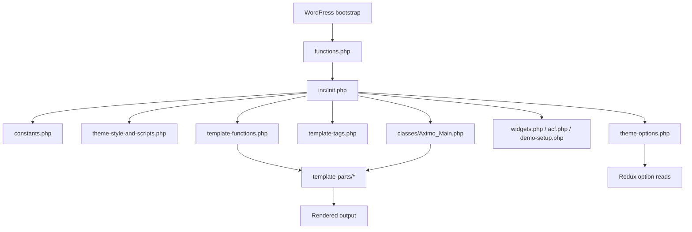

# Architecture

## Overview

Northframe is a conventional WordPress theme with a compatibility-preserving internal structure. Public branding was refreshed, while legacy runtime identifiers were intentionally retained to avoid breaking option storage, localization, plugin registration, and template behavior.

## Runtime Flow

## Component Map

| Area | Path | Responsibility |
| --- | --- | --- |
| Theme bootstrap | `functions.php` | Registers theme supports, menus, content width, and root includes |
| Module loader | `inc/init.php` | Loads constants, scripts, options, widgets, helper functions, ACF, and class files |
| Runtime helpers | `inc/template-functions.php` | Header/footer helpers, logo helpers, AJAX comments, preloader, shared rendering logic |
| Template tags | `inc/template-tags.php` | Post metadata, footer metadata, thumbnails, taxonomy helpers |
| Main rendering class | `inc/classes/Aximo_Main.php` | Breadcrumbs, archive behavior, post loop, sidebar handling |
| Theme options | `inc/theme-options.php` | Redux settings schema and defaults |
| Theme assets | `assets/` | Frontend CSS, JS, fonts, images |
| Template layer | `template-parts/`, root PHP templates | HTML rendering for pages, posts, archives, headers |
| Static docs | `documantion/` | Packaged documentation website |
| Licensing | `LICENSE`, `Licensing/` | GPL text and split-license notice |

## Request Flow

1. WordPress loads the theme and executes `functions.php`.
2. `functions.php` registers supports, menus, and includes `inc/init.php`.
3. `inc/init.php` wires the theme subsystems.
4. During frontend rendering, template files instantiate `Aximo_Main` and call helper functions and template parts.
5. Theme settings are read from the Redux-backed `aximo` option namespace.

## Compatibility Boundaries

| Element | Current Identifier | Public Label | Safe To Rename | Risk If Changed |
| --- | --- | --- | --- | --- |
| Theme name | `Northframe` | `Northframe` | Yes | Low |
| Text domain | `aximo` | Hidden implementation detail | No | Breaks translations and string lookups |
| Main class | `Aximo_Main` | Hidden implementation detail | No | Breaks template imports and runtime calls |
| Namespace | `AximoTheme` | Hidden implementation detail | No | Breaks autoload-style references and includes |
| Helper plugin slug | `aximo-helper` | `Theme Helper` in UI | No | Breaks TGMPA registration and plugin package mapping |
| Redux option key | `aximo` | Theme Options UI | No | Breaks persisted settings |

## Architectural Notes

- The architecture is compact and conventional for a commercial WordPress theme.
- The main technical debt is naming legacy, not subsystem sprawl.
- The codebase favors direct include-based composition over service-layer abstraction, which is acceptable for this theme size.
