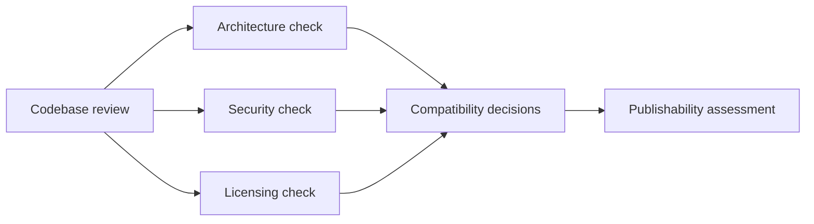

# Audit Report

## Executive Summary

Northframe was reviewed as a compatibility-preserving derivative theme package. The audit focused on runtime PHP and JavaScript code, project structure, documentation, and publication constraints.

### Result

| Category | Status | Notes |
| --- | --- | --- |
| Critical findings | None found | No critical runtime security issue was identified |
| High findings | None found | No direct SQL, shell execution, unsafe deserialization, or file-write abuse found |
| Medium findings | Resolved | Public comment AJAX handler now validates a nonce and sanitizes inputs |
| Low findings | Reduced | Rendering and output-safety defects were fixed where low-risk to change |
| Publication risk | Present | Split-license notice still governs public redistribution decisions |

## Scope

Reviewed areas:

- theme runtime PHP
- theme JavaScript involved in runtime behavior
- repository structure and packaging
- static documentation and repo-facing documentation

Excluded from deep runtime review:

- bundled vendor libraries
- demo content dumps as product content, except where they affect publication risk

## Methodology

- manual code inspection
- grep-based pattern review for risky APIs and superglobal usage
- targeted validation of theme bootstrap, helper functions, AJAX handlers, and template output paths
- syntax checks on modified PHP files

## Findings

| Severity | File | Issue | Status | Notes |
| --- | --- | --- | --- | --- |
| Medium | `inc/template-functions.php` | Public AJAX comment loader trusted raw `$_POST` without nonce or validation | Fixed | Added nonce verification, `absint()`, and post existence checks |
| Low | `inc/template-functions.php` | Sticky logo `` had malformed `src` attribute | Fixed | Corrected attribute rendering |
| Low | `header.php` | Header image `src` omitted `echo` and rendered empty | Fixed | Corrected output |
| Low | `inc/template-tags.php` | Author display name was rendered without escaping | Fixed | Escaped on output |
| Low | `inc/template-tags.php` | Comment count relied on undefined `$post_id` and raw output | Fixed | Switched to safe direct rendering |
| Low | `404.php`, `archive.php`, `index.php`, `page.php`, `single.php` | Breadcrumb helper was wrapped in `esc_html()` even though it already prints markup | Fixed | Call sites now invoke the helper directly |
| Low | `inc/template-functions.php` | Debug helper remained in production code | Fixed | Removed unused helper |
| Low | `inc/template-functions.php` | Footer copyright accepted raw admin HTML | Improved | Now filtered through `wp_kses_post()` |

## What Was Not Found

- No direct `$wpdb` query usage in theme runtime.
- No `eval`, unsafe deserialization, shell execution, or custom file-write logic in runtime theme code.
- No obvious nonce or capability gaps outside the comment load-more endpoint.

## Architecture Observations

| Observation | Assessment |
| --- | --- |
| Theme bootstrap is conventional and understandable | Good |
| Internal naming still reflects original package lineage | Acceptable compatibility tradeoff |
| Options, templates, and helper logic are tightly coupled | Normal for this theme category |
| Vendor code is bundled rather than dependency-managed | Common for commercial WordPress packages |

## Security Observations

| Area | Assessment |
| --- | --- |
| Output escaping | Mostly acceptable after targeted fixes, with trusted-admin content intentionally allowed |
| Input validation | Main public gap fixed in AJAX handler |
| Capability separation | No custom privileged workflows beyond WordPress/admin plugin flows were found |
| Attack surface | Moderate and typical for a theme with Elementor, Redux, ACF, and bundled plugins |

## Residual Risks

| Risk | Impact | Mitigation |
| --- | --- | --- |
| Split-license publication constraints | High publication risk | Keep private code repo or publish only sanitized docs unless redistribution rights are confirmed |
| Legacy internal identifiers | Low technical risk | Documented in `COMPATIBILITY.md` |
| Admin-authored HTML content | Low to moderate | Acceptable within trusted-admin WordPress model; preserve principle of least privilege in WordPress roles |

## Conclusion

After remediation, the package presents as a solid WordPress theme repository with no critical security findings discovered in runtime code. The main remaining concern is legal/publication scope, not code execution quality.
