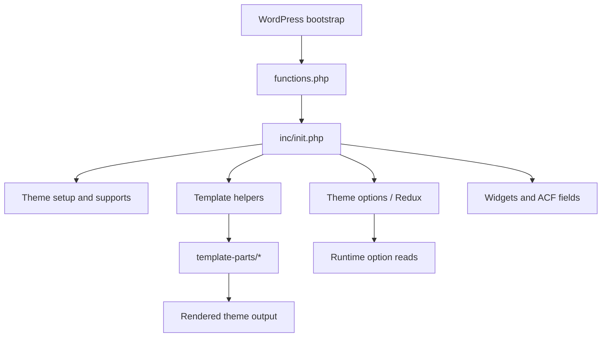

# Northframe

Northframe is a curated WordPress theme package for portfolio, agency, and service websites. This repository is the public documentation surface for the project and focuses on architecture intent, quality review, packaging policy, and maintainership.

## Scope

This repository preserves the existing PHP implementation, theme option keys, text domain, and runtime identifiers for compatibility. Internal identifiers such as `aximo`, `Aximo_Main`, and `AximoTheme` remain in place intentionally.

## What Is Included

- Public documentation pages
- Architecture and audit notes
- Compatibility and operations guidance
- Licensing reference files used by the audit narrative

## Keywords

`wordpress` `wordpress-theme` `elementor` `portfolio` `agency` `documentation` `php`

## Project At A Glance

| Area | Value |
| --- | --- |
| Public label | `Northframe` |
| Maintainer | Mykhailo Yarytskiy |
| Runtime stack | WordPress theme, PHP, JS, CSS, Elementor, Redux |
| Internal compatibility layer | `aximo` identifiers retained |
| Public docs site | This repository |
| Source repository | `mmmihaeel/northframe-wp-theme` |
| Core docs | `README.md`, `ARCHITECTURE.md`, `AUDIT.md`, `COMPATIBILITY.md`, `OPERATIONS.md`, `THIRD_PARTY.md`, `SUPPORT.md` |
| License model | Split licensing, see `LICENSE` and `Licensing/README_License.txt` |

## Feature Surface

| Capability | Status | Notes |
| --- | --- | --- |
| Elementor-powered page building | Included | Theme templates are built around Elementor compatibility |
| Redux theme options | Included | Internal option namespace remains `aximo` for compatibility |
| Bundled plugin onboarding | Included | Uses TGMPA and local plugin ZIP packages |
| Localization template | Included | Translation template remains `languages/aximo.pot` |
| Static documentation surface | Included | Served through GitHub Pages from this repository |
| GitHub Pages publication | Included | This repository is the docs-only public publication path |

## Architecture Snapshot

## Decision Record

- Internal identifiers such as `aximo`, `Aximo_Main`, and `AximoTheme` remain in place to avoid breaking runtime behavior, option storage, plugin slugs, and localization lookups.
- Public-facing branding was renamed to `Northframe`.
- GitHub Pages is handled as a documentation publication concern, not as a justification to expose the full packaged theme publicly without checking redistribution rights.

## Installation

1. Create a ZIP package of the theme directory.
2. Upload it in WordPress via `Appearance -> Themes -> Add New -> Upload Theme`.
3. Activate the theme.
4. Install the required plugins when prompted.

## Documentation

- Landing page: [`index.md`](index.md)
- Architecture: [`ARCHITECTURE.md`](ARCHITECTURE.md)
- Audit report: [`AUDIT.md`](AUDIT.md)
- Compatibility matrix: [`COMPATIBILITY.md`](COMPATIBILITY.md)
- Operations guide: [`OPERATIONS.md`](OPERATIONS.md)
- Third-party inventory: [`THIRD_PARTY.md`](THIRD_PARTY.md)
- Support policy: [`SUPPORT.md`](SUPPORT.md)

## Compatibility Note

Legacy internal identifiers are retained for compatibility:

- Text domain: `aximo`
- Option namespace: `aximo`
- Helper plugin slug: `aximo-helper`

## Repository Structure

- Documentation landing page: [`index.md`](index.md)
- Architecture and audit pages: root Markdown files
- Licensing references: [`LICENSE`](LICENSE), [`Licensing/README_License.txt`](Licensing/README_License.txt)

## Licensing

This package includes split licensing materials that must be respected.

- GPL text: [`LICENSE`](LICENSE)
- Supplemental license notice: [`Licensing/README_License.txt`](Licensing/README_License.txt)
- Third-party and derivative notes: [`CREDITS.md`](CREDITS.md)

Do not assume the entire repository is safe to redistribute publicly without verifying the rights attached to the original purchased package and bundled assets.

## Risk Notes

The codebase was audited for architecture and runtime security hygiene, but this does not convert the original package into a blanket-public redistributable theme. The main code-level issues identified during review were addressed, while the licensing boundary remains a publication decision that must be respected separately.

## GitHub Pages

This repository is intended to be published directly with GitHub Pages as a documentation-only project.

## Source Code

The runtime theme source is maintained separately in `mmmihaeel/northframe-wp-theme`.

## Support

- GitHub profile: <https://github.com/mmmihaeel>
- LinkedIn: <https://www.linkedin.com/in/mykhailo-yarytskyi-330aa0284/>

## Maintainer

Maintained by Mykhailo Yarytskiy.
