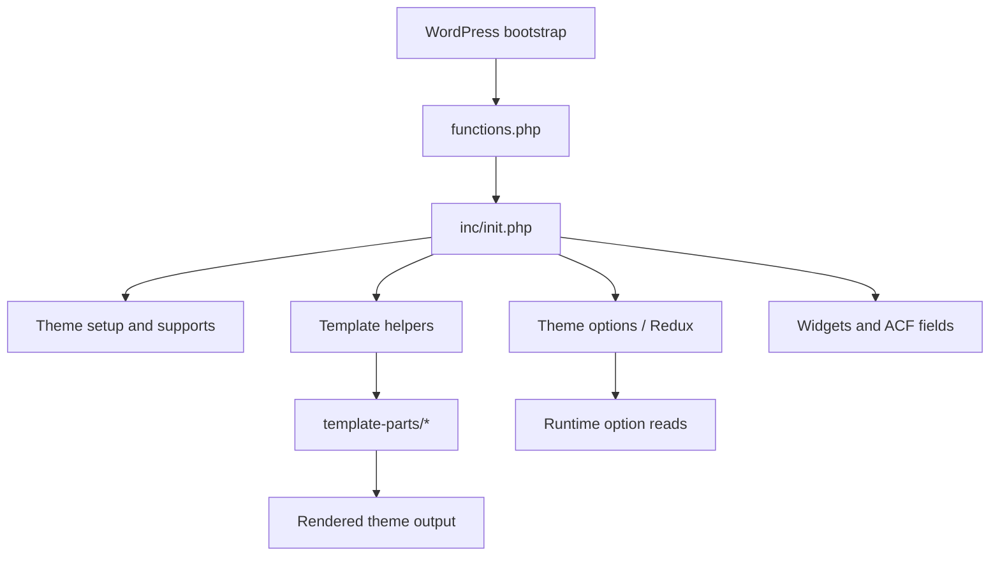

# Northframe

Northframe is a curated WordPress theme package for portfolio, agency, and service websites. This site is the public documentation surface for the project and is intentionally separated from the packaged theme source.

## Documentation Map

| Document | Purpose |
| --- | --- |
| [ARCHITECTURE.md](ARCHITECTURE.md) | Theme structure and runtime flow |
| [AUDIT.md](AUDIT.md) | Quality, security, and publication audit |
| [COMPATIBILITY.md](COMPATIBILITY.md) | Compatibility boundaries and retained identifiers |
| [OPERATIONS.md](OPERATIONS.md) | Packaging, release, and publication workflow |
| [THIRD_PARTY.md](THIRD_PARTY.md) | Third-party inventory and license boundaries |
| [SUPPORT.md](SUPPORT.md) | Support policy and reporting expectations |
| [SECURITY.md](SECURITY.md) | Security policy |

## Architecture Snapshot

## Publication Note

This GitHub Pages site is documentation-only. It exists so the project can be presented publicly without forcing the full packaged theme source into a public distribution path by default.
